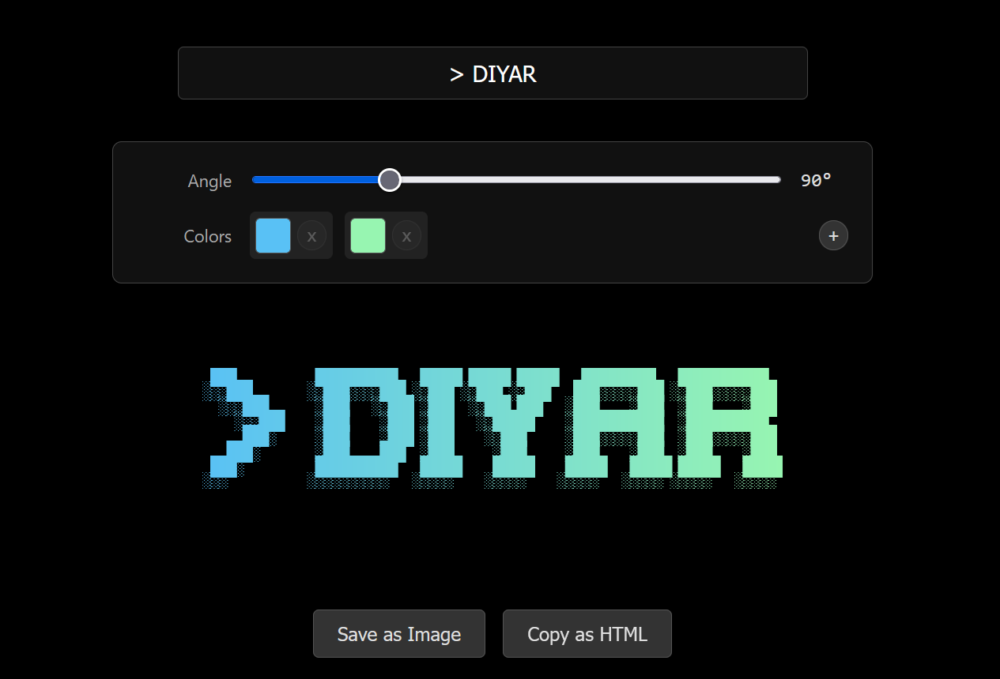

# ChromaType

<p align="center">
  <strong>Instantly generate vibrant, retro-style text art with customizable gradients.</strong>
</p>

<p align="center">
  <a href="https://github.com/DiyarD/chromatype/blob/main/LICENSE"></a>
  <a href="https://github.com/DiyarD/chromatype"></a>
  <a href="https://github.com/DiyarD/chromatype"></a>
</p>

<p align="center">
  
</p>

## About The Project

ChromaType is a lightweight web utility for creating beautiful, colorful text art. Inspired by the striking visual identity of the Google Gemini CLI, this tool uses the classic "Rebel" FIGlet font to render blocky, retro text, and then brings it to life with customizable gradients.

Whether you're creating a unique social media banner, a stylized title for a project, or just having fun with ASCII art, ChromaType provides a simple, intuitive, and powerful interface to bring your ideas to life. It runs entirely in your browser with no build steps or server-side processing required.

Try it out [here](https://diyard.github.io/chromatype).

## Features

-   🎨 **Live Rendering:** See your text art update instantly as you type.
-   🌈 **Full Gradient Control:** Easily add, remove, and change colors, and adjust the gradient angle.
-   💾 **Save as PNG:** Export your creation as a high-resolution PNG image.
-   ✂️ **Copy as HTML:** Grab the styled `<pre>` tag and embed your art directly on a webpage.
-   ⚡ **Blazing Fast:** Written in pure Vanilla JavaScript for maximum performance.
-   📦 **Zero Build Step:** Just clone and open `index.html`.

## Getting Started

Using ChromaType is as simple as it gets.

1.  Clone the repository:
    ```sh
    git clone https://github.com/DiyarD/chromatype.git
    ```
2.  Navigate to the project directory:
    ```sh
    cd chromatype
    ```
3.  Open `index.html` in your favorite web browser.

That's it! The application is now running locally.

## Built With

-   **FIGlet `Rebel.flf` Font:** The heart of the retro text style.
-   **`html-to-image`:** A fantastic library used for the "Save as Image" functionality.

## Inspiration

This project was heavily inspired by [Gemini CLI](https://github.com/google-gemini/gemini-cli). ChromaType is an attempt to capture that cool, retro-futuristic aesthetic in a simple, accessible tool.

## License

Distributed under the MIT License. See `LICENSE` for more information.
